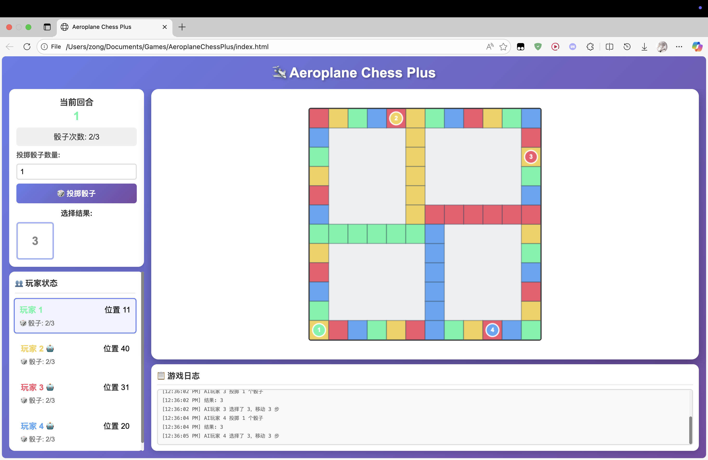

# 🎮 Games Showcase

> “Play is the highest form of research.” – Albert Einstein

## 🧩 [WhoAreYou – Psychological Horror Prototype](https://scariett77.itch.io/whoareyou)

> A minimalistic **psychological horror experience** where the player’s only interaction is answering questions on a mysterious questionnaire.  
> The game explores **isolation, anxiety, and introspection** through constrained player choices.

  

### 👥 Team

* [Scarlett](https://github.com/murdercase17)  
* [Kanna](https://github.com/FallGuy102)
* [Zong](https://zong4.github.io)  
* [Goonirus](https://github.com/goonirus)  

## 🧩 AeroplaneChessPlus – Strategic Dice Racing Game

> **AeroplaneChessPlus** reimagines the classic *Aeroplane Chess* by removing the traditional four-piece-per-player setup and introducing a system of **limited resources** and **tactical risk management** — emphasizing *necessary failure* as part of the core gameplay loop.

  

### ⚙️ Core Mechanics

1. **Single Piece Control**  
   Each player controls **only one piece** on the board.
2. **Dice Slots System**  
   Every player starts with **three dice slots**, representing dice available for rolling.
3. **Dice Consumption**  
   Each time a die is used, its corresponding slot becomes **empty**.
4. **Refilling Dice**  
   When all dice are spent, the player must **return to the starting point** to **refill** all dice slots.
5. **Resource Points**  
   Certain board spaces are **resource points** that **increase** a player’s **maximum number of dice slots**, enhancing future flexibility. In this version, **resource points are placed on grids that share the same color as the player’s piece**, encouraging strategic movement across one’s own color path.
6. **Stealing Mechanic**  
   When a player **overtakes** another, they can **steal dice slots** from the opponent.  
7. **Strategic Rolling**  
   Players may choose **how many dice to roll** each turn. When rolling multiple dice, the player can freely **select the result** used for movement.

### 👥 Team
* [Kanna](https://github.com/FallGuy102)
* [Zong](https://zong4.github.io)  
